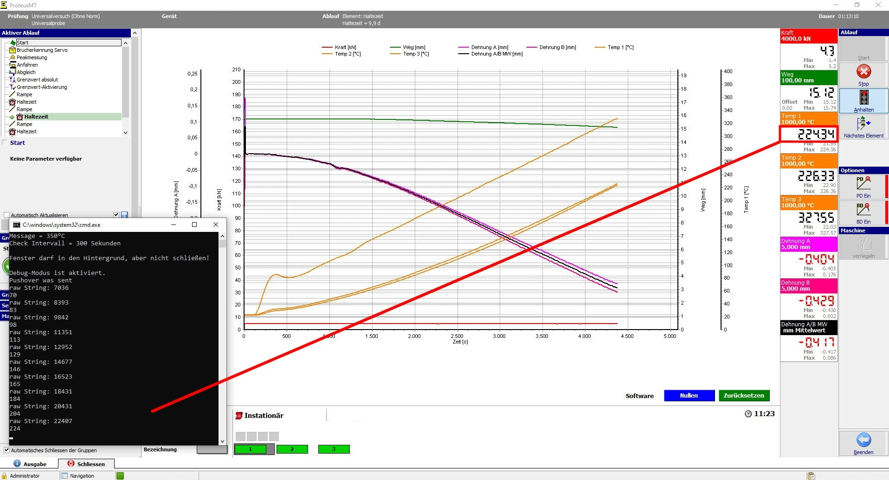

## PMTpush
PMTpush extracts a value from a digital display (like 7 segment) in Proteus MT and sends a Message via pushover
if the message threshold is reached.

Tesseract is used for the OCR method.  
Pre-compiled Windows binaries are available at the UB Mannheim https://digi.bib.uni-mannheim.de/tesseract/?C=M;O=D

I have found the training data for 7 segment digits at https://github.com/Shreeshrii/tessdata_ssd
The best results I got with ssd (best version) "-l ssd".

To send the pushover message, I use pushover-cli. https://github.com/markus-perl/pushover-cli

